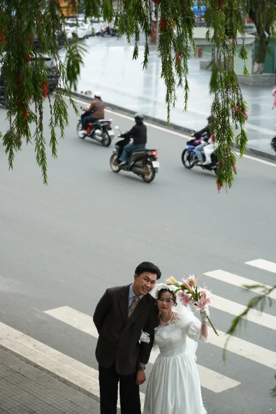

# Thiệp cưới Khánh & Nhung

Trang thiệp cưới một trang, viết bằng **HTML + CSS + JavaScript thuần**.
Không dùng framework, không cần cài đặt gì, không có bước build.

---

## Chạy thử

Mở thẳng `index.html` bằng trình duyệt là xem được.

Nếu muốn giống môi trường thật (và để font/ảnh chắc chắn tải đúng), chạy một
máy chủ tĩnh trong thư mục dự án:

```bash
python3 -m http.server 8000
# rồi mở http://localhost:8000
```

---

## Cấu trúc thư mục

```
index.html          Toàn bộ nội dung thiệp. Không có inline style.
README.md           File bạn đang đọc.
khach-moi.html      Trang phụ: xem danh sách khách + đường dẫn riêng của từng người.

css/
  fonts.css         Khai báo font (@font-face). Hiếm khi phải sửa.
  base.css          Bảng màu, font, lớp dùng chung.   ← ĐỌC FILE NÀY TRƯỚC
  sections.css      Giao diện từng phần của thiệp.
  envelope.css      Bìa phong bì mở đầu.
  reveal.css        Hiệu ứng ảnh bay vào khi cuộn.

js/
  khach-moi.js      Danh sách khách mời (chỉ là dữ liệu).
  envelope.js       Dựng bìa phong bì, xử lý chạm mở.
  countdown.js      Đếm ngược + nút "Thêm vào lịch".
  carousel.js       Đổi giữa hai lớp ảnh.
  wishes.js         Sổ lưu bút.
  reveal.js         Hiệu ứng ảnh bay vào khi cuộn.

assets/
  img/              Ảnh cưới và ảnh thiệp.
  fonts/            File font.
```

Mỗi file JS lo đúng **một** việc và không phụ thuộc file khác (trừ
`envelope.js` cần `khach-moi.js` nạp trước để đọc danh sách tên). Bỏ bớt file
nào thì chỉ mất đúng tính năng đó, phần còn lại vẫn chạy bình thường.

---

## Các phần của thiệp

Cuộn từ trên xuống, khách sẽ thấy theo thứ tự:

| id | Phần | Xử lý bởi |
|---|---|---|
| `#sec-page-1` | Ảnh thiệp trang 1 + tên viết tay | — |
| `#sec-page-2` | Ảnh thiệp trang 2 | — |
| `#sec-countdown` | Đếm ngược + nút thêm vào lịch | `js/countdown.js` |
| `#sec-page-3` | Ảnh thiệp trang 3 | — |
| `#sec-album` | Album cưới, lưới 2×2 | — |
| `#sec-strip` | Dải ảnh ( 01 )( 02 )( 03 ) | `js/carousel.js` |
| `#sec-collage` | Collage 3 ảnh xếp lệch | `js/carousel.js` |
| `#sec-layer` | Ảnh lồng lớp | `js/carousel.js` |
| `#sec-wishes` | Sổ lưu bút | `js/wishes.js` |
| `#sec-thanks` | Cảm ơn | — |

**Quy tắc tìm code:** phần nào có id gì thì style của nó nằm đúng khối mang tên
id đó trong `css/sections.css`. Không phải dò cả file.

---

## Những việc hay làm nhất

### Đổi một tấm ảnh

Sửa `src` của thẻ `` tương ứng trong `index.html`, file ảnh để trong
`assets/img/`. Mọi ảnh đều nằm trong một khung theo mẫu:

```html
<div class="khung-anh">
  
</div>
```

Khung lo tỉ lệ và màu nền, ảnh bên trong tự phủ kín khung (`object-fit: cover`)
nên **không bao giờ bị méo**, chỉ bị cắt bớt phần thừa.

Ảnh bị cắt mất mặt người? Thêm một trong hai lớp này cho thẻ `` (đang dùng
ở album):

```html
   <!-- lấy phần trên khung hình -->
   <!-- lấy phần dưới khung hình -->
```

### Đổi màu hoặc font

Sửa trong khối `:root` ở đầu `css/base.css`. Mọi màu và font khai báo ở đó
**một lần**, các file khác chỉ gọi lại bằng `var(--ten-bien)`.

### Đổi ngày cưới

Sửa khối `THÔNG TIN ĐÁM CƯỚI` ở đầu `js/countdown.js`, rồi sửa dòng chữ
`14.11.2026 | 10:00 AM` trong `index.html` cho khớp.

### Thêm khách mời

Sửa `js/khach-moi.js`, mỗi người một dòng:

```js
"nam": "Anh Nam",
```

Rồi gửi cho họ đường dẫn `.../index.html?k=nam` — bìa thiệp sẽ hiện
"Thân mời — Anh Nam". Mở `khach-moi.html` bằng trình duyệt để xem và sao chép
đường dẫn của từng người.

### Chỉnh hiệu ứng bay vào

Sửa các biến ở `css/reveal.css`, không cần đụng vào JS:

| Biến | Ý nghĩa |
|---|---|
| `--rv-x` | lệch ngang lúc chờ (dương = bay từ phải vào) |
| `--rv-y` | lệch dọc lúc chờ (dương = nổi từ dưới lên) |
| `--rv-s` | cỡ ảnh lúc chờ (`1` = đúng cỡ) |
| `--rv-d` | chờ bao lâu rồi mới bay (để ảnh vào lần lượt) |

---

## Ba điều dễ vấp — đọc trước khi sửa

### 1. Lưới chứa ảnh phải viết `minmax(0, 1fr)`, không viết `1fr`

```css
/* ĐÚNG */   grid-template-columns: minmax(0, 1fr) minmax(0, 1fr);
/* SAI  */   grid-template-columns: 1fr 1fr;
```

Viết `1fr` thì mỗi cột có bề rộng tối thiểu tự động bằng nội dung bên trong.
Ảnh to sẽ đẩy cột phình ra, và trên **Safari/iPhone** cả phần đó vỡ tung, đẩy
những phần bên dưới đi mất. Chrome trên máy tính không bị nên rất dễ tưởng là
vẫn ổn. Đây là lỗi đã từng xảy ra thật với phần album.

### 2. Lề trái/phải dùng biến `--le-ngang`, không viết @media riêng

```css
#sec-album{ padding: 76px var(--le-ngang) 84px; }
```

Biến này tự nhỏ lại trên điện thoại (khai báo ở cuối `css/base.css`). Không cần
viết thêm `@media` chỉ để thu lề.

### 3. Chữ do khách gõ phải dùng `textContent`, không dùng `innerHTML`

Xem `js/wishes.js`. Ghép chữ của khách thẳng vào HTML thì người ta gõ thẻ HTML
vào sẽ chạy thật (lỗ hổng XSS).

---

## Hai lớp ảnh (carousel)

Ba phần `#sec-strip`, `#sec-collage`, `#sec-layer` mỗi phần có **hai lớp ảnh**
chồng khít lên nhau:

- lớp 1 = ảnh 01–03 (đang dùng)
- lớp 2 = ảnh 04–06 (**chưa gán ảnh**, để dành thêm sau)

Lớp nào đang hiện thì mang `data-hien="1"`, lớp ẩn mang `data-hien="0"`.

Hiện chưa có nút chuyển lớp nên lúc nào cũng hiện lớp 1 — đó là cố ý vì lớp 2
chưa có ảnh. Cách thêm ảnh và bật chuyển lớp ghi ở cuối `js/carousel.js`.

---

## Một điều cần biết về sổ lưu bút

Lời chúc khách gửi **chỉ hiện trên máy của chính họ** và mất khi tải lại trang.
Thiệp này là trang tĩnh, không có máy chủ để lưu. Muốn thật sự nhận được lời
chúc thì phải nối vào một dịch vụ lưu trữ — gợi ý cách làm bằng Google Form ghi
ở cuối `js/wishes.js`.

---

## Hỗ trợ trình duyệt

Chạy tốt trên Chrome, Safari (kể cả iPhone), Firefox, Edge bản mới, và trình
duyệt trong ứng dụng nhắn tin (Messenger, Zalo).

Trình duyệt quá cũ không có `IntersectionObserver` thì mất hiệu ứng bay vào,
**ảnh vẫn hiện đầy đủ bình thường** — hiệu ứng được thiết kế để hỏng một cách
an toàn, không bao giờ làm ảnh kẹt ở trạng thái ẩn.
